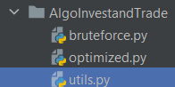

# AlgoInvest & Trade

### Investissements et algorithmes

#### Algorithme brut

La version "bruteforce" de l'algorithme permet de calculer TOUTES les combinaisons possibles.

Un conseil, sur un échantillon d'une dizaine d'actions le temps d'éxecution n'est pas long mais plus il y a d'actions, plus le temps d'éxecution sera long, c'est exponentiel.

#### Algorithme optimisé

La version "optimized" permet de trouver de manière optimisée l'action ayant le plus gros profit en euros (€).

Cet Algorithme calcul le profit en fonction du prix d'une action et son pourcentage de bénéfice après deux ans.

### Cas d'utilisation

L'objectif est simple : trouver l'action la plus rentable grâce à l'algorithme de chez AlgoInvest & Trade.

#### Première étape : les données



##### Entrez le nom de votre jeu de données dans le fichier "utils.py".

```python
file = open("../data/dataset1_Python+P7_echantillon_20.csv")
```

Dans l'exemple ci-desssus, il s'agit d'un échantillon de test pour 19 actions précisément. Mais si vous souhaitez utiliser le jeu de données contenant toutes les actions,
vous pouvez remplacer `P7_echantillon_20.csv` par le nom de votre fichier,
dans notre cas c'est : `dataset1_Python+P7_full_one.csv`
</br> et/ou `dataset1_Python+P7_full_one.csv`.


#### Lancer le programme :

Placez-vous dans le fichier **optimized.py** :

- cd ./AlgoInvestandtrade
- py -m optimized

constatez le résultat ! 🙃

Placez-vous dans le fichier **bruteforce.py** :

- cd ./AlgoInvestandtrade
- py -m bruteforce

☣️ Attention ☣️

Utilisez le raccourci clavier **Ctrl+C** pour tuer l'éxecution du code après quelques secondes (sauf dans le cas où votre jeu de données est celui de l'échantillon pour tester cet algorithme brut)


*************************************************

### Notes :

Git Flow est utilisé pendant la construction et le maintient du projet.

Il faut respecter certaines conventions de nommage de commit ([ADD] / [FIX]), de nom de branche (release/"nom_de_la_branche", bugfix/, etc.).

[Documentation de Git Flow](https://www.atlassian.com/fr/git/tutorials/comparing-workflows/gitflow-workflow)
